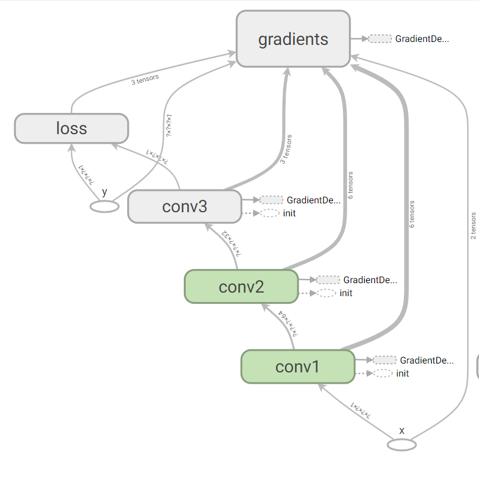

# a simple code for SRCNN using tensorflow
I refer to the code in the paper 
[Image Super-Resolution Using Deep Convolutional Networks] (https://arxiv.org/abs/1501.00092v3)

## model 

## Requirements
* python 3
* tensorflow-gpu(or tensorflow, but you might need to edit the code)
* numpy
* PIL
* h5py
* matplotlib

## Train
use "python solver.py" to train the model, if you want to indicate the data you want to use, just put your data into the directory and indicate your training data path, just like:

python solver.py --data_dir my_training_data --h5_dir my_train_h5_data

more usage can be found in utils/args.py

## Test
python solver.py --mode test
and just as above mentioned, you can indicate your test data

## Others
Thanks for the projects below, and these projects help me a lot:

* https://github.com/tegg89/SRCNN-Tensorflow
* http://mmlab.ie.cuhk.edu.hk/projects/SRCNN.html